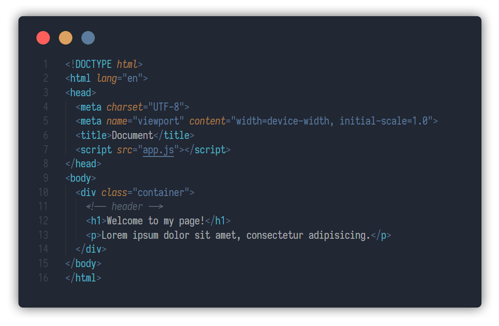
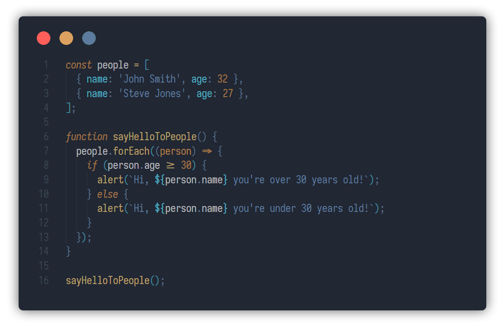
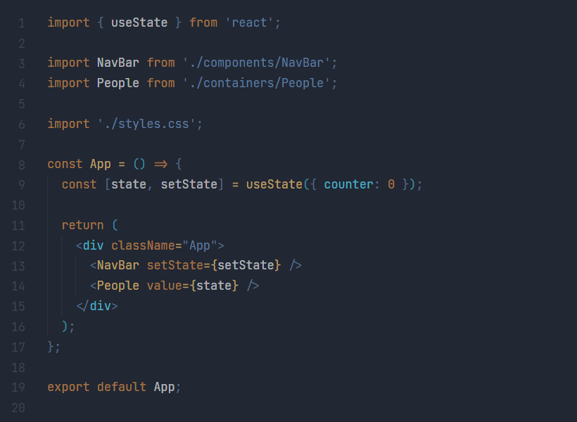
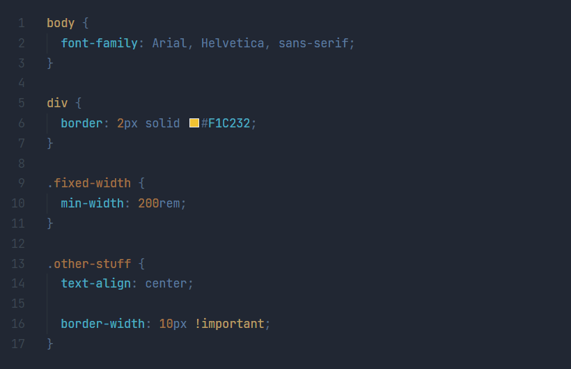

# Soft Colors (VSCode Theme)

A dark theme for [Visual Studio Code](http://code.visualstudio.com).

Soft Colors was created with care for your eyes.
I tried to save a low contrast balance with the least loss of code perception.

## Install

Open Visual Studio Code Market Place in your Visual Studio Code, and search Soft Colors. Hit install button, and after finishing install, go to ```Preferences > Color Theme > Soft Colors```.

## Screenshots

Some demo for syntax highlighting in JavaScript, React, HTML, and CSS. The recommended font for use with this theme is [Iosevka Font](https://github.com/be5invis/Iosevka).

### HTML



### JavaScript



### React.js



### CSS



## Change Log

[View the Change Log here](https://github.com/victorlitvinenko/vscode-soft-colors/blob/master/CHANGELOG.md)
